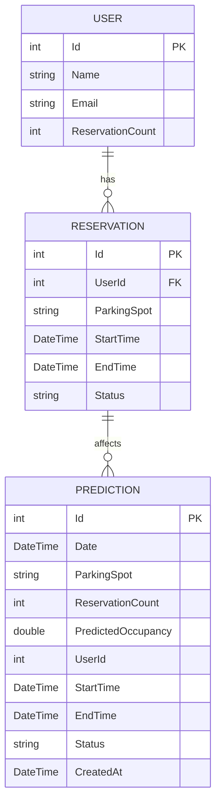

# System Parkingowy – Dokumentacja

## 1. Opis projektu

System parkingowy składa się z trzech mikroserwisów:
- **UserService** – zarządzanie użytkownikami
- **ReservationService** – zarządzanie rezerwacjami miejsc parkingowych
- **PredictionService** – prognozowanie zajętości parkingu na podstawie rezerwacji

Serwisy komunikują się asynchronicznie przez RabbitMQ oraz synchronicznie przez HTTP.

---

## 2. Stos technologiczny

- **Język programowania:** C# (.NET 8)
- **Framework:** ASP.NET Core Web API
- **Baza danych:** SQL Server (Entity Framework Core)
- **Komunikacja asynchroniczna:** RabbitMQ
- **Testy:** xUnit, Moq, Microsoft.AspNetCore.Mvc.Testing
- **Konteneryzacja:** Docker, Docker Compose (opcjonalnie)
- **Inne:** Swagger (OpenAPI) do dokumentacji endpointów

---

## 3. Instrukcja uruchamiania

### Najszybszy start – uruchomienie wszystkiego przez Docker Compose

1. Upewnij się, że masz zainstalowanego Dockera i Docker Compose.
2. W katalogu głównym projektu uruchom:
   ```sh
   docker-compose up --build
   ```

To polecenie zbuduje i uruchomi wszystkie serwisy oraz RabbitMQ. Po chwili aplikacja będzie dostępna na odpowiednich portach (sprawdź docker-compose.yml i README poniżej).

### Wymagania systemowe
- .NET 8 SDK
- Docker (jeśli chcesz uruchomić RabbitMQ i/lub bazę w kontenerze)
- SQL Server (lokalnie lub w kontenerze)
- RabbitMQ (lokalnie lub w kontenerze)

### Kroki uruchomienia
1. **Uruchom RabbitMQ**  
   Możesz użyć Docker Compose lub własnej instancji RabbitMQ.
   ```sh
docker run -d --hostname my-rabbit --name some-rabbit -p 5672:5672 -p 15672:15672 rabbitmq:3-management
```
2. **Ustaw connection string do bazy w plikach `appsettings.json` każdego serwisu.**
3. **Uruchom każdy serwis:**
   ```sh
dotnet run --project UserService/UserService.csproj
dotnet run --project ReservationService/ReservationService.csproj
dotnet run --project PredictionService/PredictionService.csproj
```
4. **Swagger**  
   Po uruchomieniu serwisów wejdź na:  
   - http://localhost:5000/swagger (UserService)  
   - http://localhost:5001/swagger (ReservationService)  
   - http://localhost:5002/swagger (PredictionService)  

5. **Testy**
   ```sh
dotnet test
```

### 4. Wykonanie migracji bazy danych

Aby utworzyć tabele w bazie danych, należy wykonać migracje dla każdego serwisu:

1. **Zainstaluj narzędzie Entity Framework Core Tools (jeśli nie masz):**
   ```sh
   dotnet tool install --global dotnet-ef
   ```

2. **W katalogu każdego serwisu wykonaj migracje:**
   ```sh
   cd UserService
   dotnet ef database update
   cd ..

   cd ReservationService
   dotnet ef database update
   cd ..

   cd PredictionService
   dotnet ef database update
   cd ..
   ```

Po tej operacji bazy danych będą gotowe do użycia przez aplikację.

---

## 4. Zrzuty ekranu

### Swagger - UserService


### Swagger - ReservationService


### Swagger - PredictionService


### Testy


---

## 5. Diagram bazy danych



---

## 6. Diagram UML przypadków użycia

```mermaid
usecase
  actor "Użytkownik" as User
  actor "System" as System

  User --> (Rejestracja konta)
  User --> (Logowanie)
  User --> (Rezerwacja miejsca)
  User --> (Podgląd rezerwacji)
  User --> (Podgląd prognozy zajętości)

  (Rejestracja konta) --> (UserService)
  (Rezerwacja miejsca) --> (ReservationService)
  (Podgląd prognozy zajętości) --> (PredictionService)
```

---

## 7. Opis kluczowych elementów back-endu

### UserService
- Zarządza użytkownikami (CRUD)
- Przechowuje liczbę rezerwacji użytkownika (`ReservationCount`)
- Odbiera zdarzenia rezerwacji z RabbitMQ i aktualizuje statystyki

### ReservationService
- Zarządza rezerwacjami miejsc parkingowych (CRUD)
- Przed utworzeniem rezerwacji sprawdza, czy użytkownik istnieje (HTTP do UserService)
- Po utworzeniu rezerwacji publikuje zdarzenie do RabbitMQ

### PredictionService
- Odbiera zdarzenia rezerwacji z RabbitMQ
- Tworzy lub aktualizuje predykcje zajętości parkingu na podstawie rezerwacji

---

## 8. Opis przypadków testowych (Gherkin)

**Przykład:**
```
Feature: Rezerwacja miejsca parkingowego

  Scenario: Użytkownik rezerwuje miejsce
    Given Istnieje użytkownik o id 1
    When Użytkownik rezerwuje miejsce "A1" na dzień 2024-07-10
    Then Rezerwacja zostaje utworzona
    And Liczba rezerwacji użytkownika wzrasta o 1
    And PredictionService aktualizuje prognozę zajętości dla miejsca "A1"
```

**Testy jednostkowe:**
- UserController: GET, POST, PUT, DELETE użytkownika
- ReservationController: GET, POST, PUT, DELETE rezerwacji (z walidacją użytkownika)
- PredictionController: GET, POST, PUT, DELETE predykcji

**Testy integracyjne:**
- Tworzenie użytkownika i rezerwacji (sprawdzenie powiązania)
- Sprawdzenie, że nie można utworzyć rezerwacji dla nieistniejącego użytkownika
- Sprawdzenie, że PredictionService aktualizuje predykcję po nowej rezerwacji

---

## 9. Wykaz wykorzystanej literatury i źródeł

- [Dokumentacja .NET](https://docs.microsoft.com/dotnet/)
- [Dokumentacja ASP.NET Core](https://docs.microsoft.com/aspnet/core/)
- [Dokumentacja RabbitMQ](https://www.rabbitmq.com/documentation.html)
- [Entity Framework Core](https://learn.microsoft.com/ef/core/)
- [xUnit](https://xunit.net/)
- [Moq](https://github.com/moq/moq4)
- [Swagger/OpenAPI](https://swagger.io/docs/)

---

*Pamiętaj, by dodać własne zrzuty ekranu do folderu screenshots/ oraz ewentualnie dodać własne diagramy wygenerowane z narzędzi!*

---

## 10. Publikacja projektu na GitHubie

1. Zainicjuj repozytorium git (jeśli jeszcze nie istnieje):
   ```sh
git init
git add .
git commit -m "Initial commit"
```
2. Utwórz nowe repozytorium na GitHubie (np. przez stronę github.com).
3. Połącz lokalne repozytorium z GitHubem:
   ```sh
git remote add origin https://github.com/TWOJ_LOGIN/TWOJE_REPOZYTORIUM.git
git branch -M main
git push -u origin main
```
4. Upewnij się, że pliki `.gitignore` i `LICENSE` są obecne w repozytorium. 
